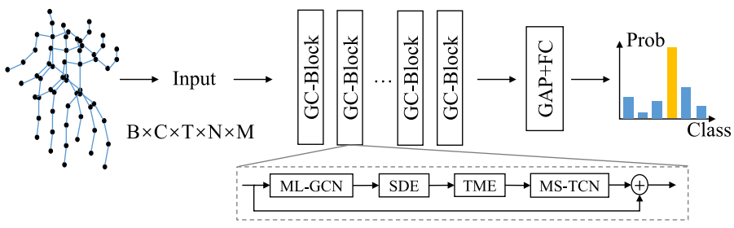

# ML-STGNet
PyTorch implementation of "Multilevel Spatial–Temporal Excited Graph Network for Skeleton-Based Action Recognition", T-IP 2022.
[[PDF](https://ieeexplore.ieee.org/document/9997556/)]



## Data Preparation
Four datasets are used in our experiments.

#### NTU-60 and NTU-120 
1. Request datset here: http://rose1.ntu.edu.sg/Datasets/actionRecognition.asp
2. Download the skeleton-only datasets:
  - `nturgbd_skeletons_s001_to_s017.zip`  (NTU RGB+D 60)
  - `nturgbd_skeletons_s018_to_s032.zip`  (NTU RGB+D 120, on top of NTU RGB+D 60)

#### Skeleton-Kinetics
1. Download dataset from ST-GCN repo: https://github.com/yysijie/st-gcn/blob/master/OLD_README.md#kinetics-skeleton

#### Toyota Smarthome
1. Download the raw data from https://github.com/YangDi666/SSTA-PRS#refined-pose-data (skeleton-v2.0 refined by SSTA-PRS)

### Directory Structure
Put downloaded data into the following directory structure:
```
- data/
  - kinetics_raw/
    - kinetics_train/
      ...
    - kinetics_val/
      ...
    - kinetics_train_label.json
    - kinetics_val_label.json
  - nturgbd_raw/
    - nturgb+d_skeletons/     # from `nturgbd_skeletons_s001_to_s017.zip`
      ...
    - nturgb+d_skeletons120/  # from `nturgbd_skeletons_s018_to_s032.zip`
      ...
    - NTU_RGBD_samples_with_missing_skeletons.txt
    - NTU_RGBD120_samples_with_missing_skeletons.txt
   - smarthone_raw/
    - smarthone_skeletons/
      ...    
```

### Generating Data
1. NTU-60 and NTU-120:
```
 cd ./data_gen/ntu # or cd ./data_gen/ntu120
 # Get skeleton of each performer
 python get_raw_skes_data.py
 # Remove the bad skeleton 
 python get_raw_denoised_data.py
 # Transform the skeleton to the center of the first frame
 python seq_transformation.py
```
2. Skeleton-Kinetics:
```
 cd ./data_gen
 python kinetics_gendata.py
```
3. Toyota Smarthome:
```
 cd ./data_gen
 python smarthome_gendata.py
```
4. bone data:
```
python gen_bone_data.py --dataset {}
```

## Training & Testing
### Training
- Change the config file depending on what you want:
```
# Example: training ML-STGNet on NTU-60 cross-subject
python main.py --config config/nturgbd-cross-subject/train_joint.yaml 
python main.py --config config/nturgbd-cross-subject/train_bone.yaml
```
### Testing
- To ensemble the results of joints and bones, run test firstly to generate the scores:
```
# Example: testing ML-STGNet on NTU-60 cross-subject
python main.py --config config/nturgbd-cross-subject/test_joint.yaml 
python main.py --config config/nturgbd-cross-subject/test_bone.yaml
```

- Then combine the scores:
```
python ensemble.py --dataset ntu/xsub
```

- One more step on Smarthome:
```
# cross-subject
python evaluation-cs.py eval/smarthome/xsub/result_ensemble.txt 31
# cross-view
python evaluation-cv.py eval/smarthome/xview1/result_ensemble.txt 19
python evaluation-cv.py eval/smarthome/xview2/result_ensemble.txt 19
```

## Acknowledgements

This repo is based on
  - [2s-AGCN](https://github.com/lshiwjx/2s-AGCN)
  - [SGN](https://github.com/microsoft/SGN)
  - [UNIK](https://github.com/YangDi666/UNIK)
 
## Citation

Please cite this work if you find it useful:
```
@ARTICLE{9997556,
  author={Zhu, Yisheng and Shuai, Hui and Liu, Guangcan and Liu, Qingshan},
  journal={IEEE Transactions on Image Processing}, 
  title={Multilevel Spatial–Temporal Excited Graph Network for Skeleton-Based Action Recognition}, 
  year={2023},
  volume={32},
  number={},
  pages={496-508},
  doi={10.1109/TIP.2022.3230249}}
 ```
